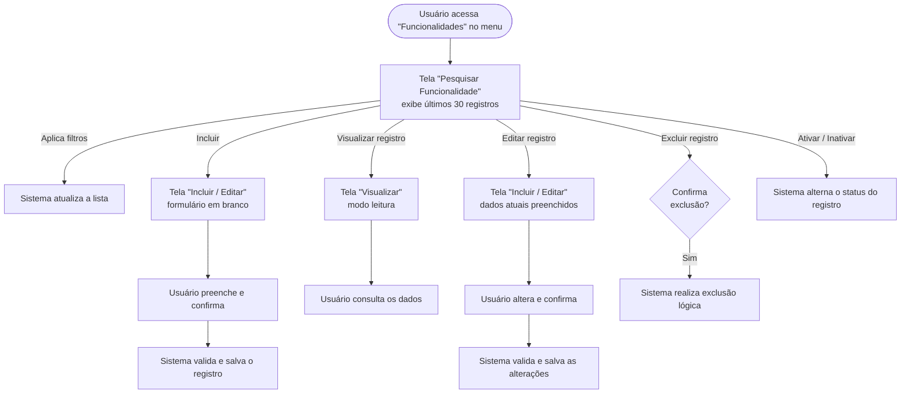

# Feature Set: Gestão de Funcionalidades

**Nível 2 — Feature Set**
**ID**: SIS-002

---

## Responsabilidade

### O que este Feature Set faz

Gerencia o cadastro de funcionalidades do sistema, permitindo incluir, consultar, editar, excluir e controlar o status (ativo/inativo) de cada funcionalidade registrada. É o ponto de partida para a rastreabilidade entre funcionalidades e demais artefatos de projeto.

### O que este Feature Set NÃO faz

Não realiza gestão de requisitos, contagens de pontos de função ou qualquer vínculo com outras disciplinas. Não controla permissões de acesso ao sistema — apenas registra as funcionalidades existentes.

---

## Features

| Nome | ID (N3 futuro) | Descrição |
|---|---|---|
| Pesquisar Funcionalidades | SIS-002-01 | Permite ao usuário localizar funcionalidades cadastradas por meio de filtros, exibindo os resultados em lista paginada. |
| Visualizar Funcionalidade | SIS-002-02 | Exibe os dados completos de uma funcionalidade em modo leitura, sem possibilidade de edição. |
| Incluir Funcionalidade | SIS-002-03 | Permite ao usuário cadastrar uma nova funcionalidade, preenchendo os dados no formulário. |
| Editar Funcionalidade | SIS-002-04 | Permite ao usuário alterar os dados de uma funcionalidade já cadastrada. |
| Excluir Funcionalidade | SIS-002-05 | Realiza a exclusão lógica de uma funcionalidade, mantendo o histórico no banco de dados. |
| Ativar / Inativar Funcionalidade | SIS-002-06 | Alterna o status de uma funcionalidade entre ativo e inativo diretamente na listagem. |

---

## Fluxo Principal

---

## Dependências entre Features

| Feature | Depende de | Observação |
|---|---|---|
| Pesquisar Funcionalidades | — | Ponto de entrada do Feature Set; não possui dependência. |
| Incluir Funcionalidade | — | Acessado a partir da tela de pesquisa; não depende de registro existente. |
| Visualizar Funcionalidade | Pesquisar Funcionalidades | O registro deve ser localizado antes de ser visualizado. |
| Editar Funcionalidade | Pesquisar Funcionalidades | O registro deve ser localizado antes de ser editado. |
| Excluir Funcionalidade | Pesquisar Funcionalidades | O registro deve ser localizado antes de ser excluído. |
| Ativar / Inativar Funcionalidade | Pesquisar Funcionalidades | A alternância de status ocorre a partir da listagem. |

---

## Telas

| Nome da Tela | Rota | Features Atendidas |
|---|---|---|
| Pesquisar Funcionalidade | `/sistema/funcionalidades` | Pesquisar Funcionalidades · Excluir Funcionalidade · Ativar / Inativar Funcionalidade |
| Incluir / Editar Funcionalidade | `/sistema/funcionalidades/nova` e `/sistema/funcionalidades/:id/editar` | Incluir Funcionalidade · Editar Funcionalidade |
| Visualizar Funcionalidade | `/sistema/funcionalidades/:id` | Visualizar Funcionalidade |

> ⚠️ As rotas acima são sugestões baseadas no padrão do projeto. Devem ser confirmadas na etapa técnica (PROMPT 2B).

---

## Permissões por Perfil

| Perfil | Pesquisar | Visualizar | Incluir | Editar | Excluir | Ativar / Inativar |
|---|---|---|---|---|---|---|
| Administrador | ✅ | ✅ | ✅ | ✅ | ✅ | ✅ |

> ⚠️ Apenas o perfil **Administrador** foi identificado como usuário deste Feature Set.
> Caso existam outros perfis no sistema (ex.: usuário comum, analista, somente leitura),
> suas permissões devem ser definidas e incluídas nesta tabela antes da etapa técnica.

---

## Regras de Negócio Aplicáveis

> ⚠️ As regras específicas das funcionalidades (campos obrigatórios, validações, unicidade de valores etc.)
> não foram detalhadas nos insumos fornecidos. Devem ser levantadas e registradas no
> `global/RULES-DICTIONARY.md` antes do detalhamento técnico (PROMPT 2B).

As regras transversais do domínio SIS se aplicam a este Feature Set:

- **Soft delete**: Funcionalidades não são removidas permanentemente — apenas excluídas de forma lógica (Excluir Funcionalidade segue esta regra).
- **Multitenancy**: Todas as funcionalidades pertencem a uma organização; nenhuma consulta ou operação é realizada sem esse vínculo.
