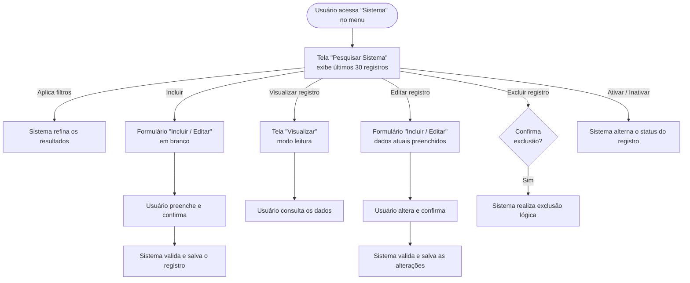

📄 `modules/SIS/SIS-001/README.md`

---

**Nível 2 — Feature Set**
**ID**: SIS-001

# Gestão de Sistemas

---

## Responsabilidade

**O que este Feature Set faz**
Permite ao usuário cadastrar novos sistemas, consultar os sistemas existentes, visualizar seus dados completos, editar informações já registradas, excluir registros e ativar ou inativar sistemas conforme necessário.

**O que este Feature Set NÃO faz**
Não gerencia requisitos, contagens de pontos de função, nem qualquer outra disciplina derivada do sistema. Não realiza vinculações com outros domínios além do cadastro em si.

---

## Features

| Nome | ID (N3 futuro) | Descrição |
|---|---|---|
| Pesquisar Sistema | SIS-001-01 | O usuário filtra e localiza sistemas cadastrados com base em critérios informados. Ao acessar a tela, os últimos 30 registros são exibidos automaticamente. |
| Visualizar Sistema | SIS-001-02 | O usuário consulta todos os dados de um sistema específico em modo somente leitura. |
| Incluir Sistema | SIS-001-03 | O usuário cadastra um novo sistema, informando os dados gerais e tecnológicos. |
| Editar Sistema | SIS-001-04 | O usuário altera os dados de um sistema já cadastrado. |
| Excluir Sistema | SIS-001-05 | O usuário remove logicamente um sistema — o registro não é apagado permanentemente. |
| Ativar / Inativar Sistema | SIS-001-06 | O usuário alterna o status de um sistema entre ativo e inativo sem excluí-lo. |

---

## Fluxo Principal

---

## Dependências entre Features

| Feature | Depende de | Observação |
|---|---|---|
| Pesquisar Sistema | — | Ponto de entrada; não possui dependência. |
| Incluir Sistema | — | Pode ser acessado diretamente a partir da tela de pesquisa; não depende de nenhum registro existente. |
| Visualizar Sistema | Pesquisar Sistema | O registro deve estar visível na listagem para ser acessado. |
| Editar Sistema | Pesquisar Sistema | O registro deve estar visível na listagem para ser acessado. |
| Excluir Sistema | Pesquisar Sistema | O registro deve estar visível na listagem para ser acionado. |
| Ativar / Inativar Sistema | Pesquisar Sistema | O registro deve estar visível na listagem para ter o status alternado. |

---

## Telas

| Nome da Tela | Rota sugerida | Features atendidas | Descrição |
|---|---|---|---|
| Pesquisar Sistema | `/sistemas` | Pesquisar Sistema · Excluir Sistema · Ativar / Inativar Sistema | Exibe a listagem de sistemas (padrão: últimos 30 registros), campos de filtro para busca e ações rápidas por registro (editar, visualizar, excluir, ativar/inativar). Também contém o botão de acesso ao cadastro. |
| Incluir / Editar Sistema | `/sistemas/novo` · `/sistemas/:id/editar` | Incluir Sistema · Editar Sistema | Formulário único utilizado tanto para criação quanto para edição. No fluxo de edição, os campos são preenchidos com os dados existentes. |
| Visualizar Sistema | `/sistemas/:id` | Visualizar Sistema | Exibe todos os dados do sistema em modo somente leitura, sem permitir alterações. |

---

## Permissões por Perfil

| Perfil | Pesquisar | Visualizar | Incluir | Editar | Excluir | Ativar / Inativar |
|---|---|---|---|---|---|---|
| Administrador | ✅ | ✅ | ✅ | ✅ | ✅ | ✅ |

> ⚠️ Apenas o perfil **Administrador** foi identificado neste domínio. Caso novos perfis sejam incorporados ao sistema futuramente (ex.: usuário com acesso somente leitura, analista sem permissão de exclusão), este quadro deve ser revisado.

---

## Regras de Negócio Aplicáveis

| Regra | Descrição |
|---|---|
| Sigla única | Todo sistema deve possuir uma sigla com exatamente 5 caracteres alfanuméricos. Não podem existir dois sistemas com a mesma sigla dentro da mesma organização. |
| Apelido | O sistema pode ter um apelido que represente o nome informal pelo qual é conhecido. |
| Exclusão lógica | A ação de excluir não apaga o registro — apenas o marca como removido. O registro deixa de aparecer nas listagens ativas. |
| Multitenancy | Toda operação está sempre vinculada à organização do usuário autenticado. Nenhum sistema de outra organização é acessível. |

---

*Próximo passo: para especificar cada feature individualmente (campos, validações, critérios de aceite), use o **PROMPT 3A** passando este README como contexto.*
